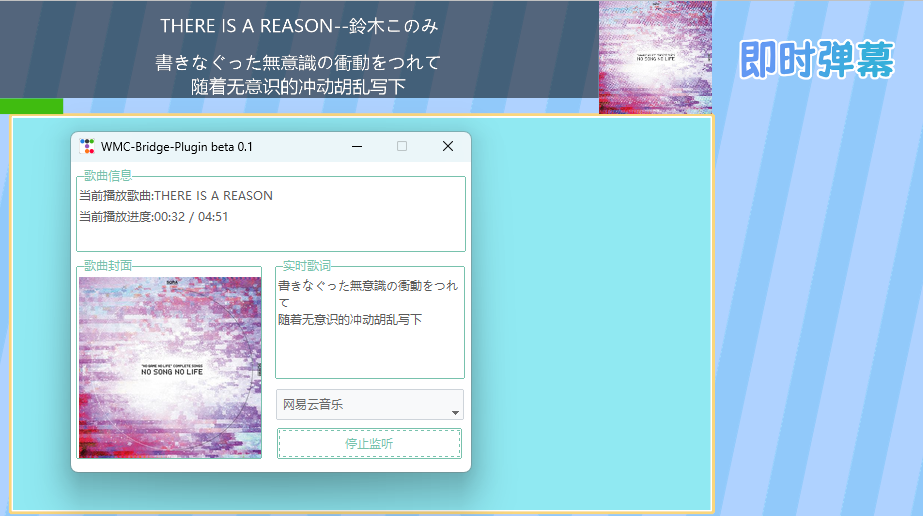

# WMC-Bridge-Plugin
      
一个简单的Python插件, 可将国内主流非支持SMTC(SystemMediaTransportControls)的音乐播放器的播放信息映射到SMTC中, 并由其他应用读取(例如OBS的Tuna插件, 可以将SMTC信息映射到直播间)  
目前该项目处于测试状态, 暂时不会发包  
若有需要可以运行install_dependencies.bat安装依赖后运行run-ttk.py使用

#### 目前支持的播放器
 
可在issue中提出你需要支持的播放器

#### 目前项目可实现的功能以及当前存在的问题
* 实时更新SMTC歌曲名, 艺术家, 缩略图, 时间线 ✅
* 实时输出当前播放歌曲的缩略图及实时歌词到路径下 ✅
* SMTC刷新缩略图时会闪烁, 由于Tuna插件会实时读取缩略图, 可能会带来额外的磁盘损耗 ❎
* 使用多进程, 内存开销较大 ❎
* 无法正确识别进程被杀死, 如果强行结束进程会导致SMTC无法关闭 ❎

#### 使用效果

#### 使用教程
请等待正式版发布后查看教程, 或查询Tuna插件基础用法